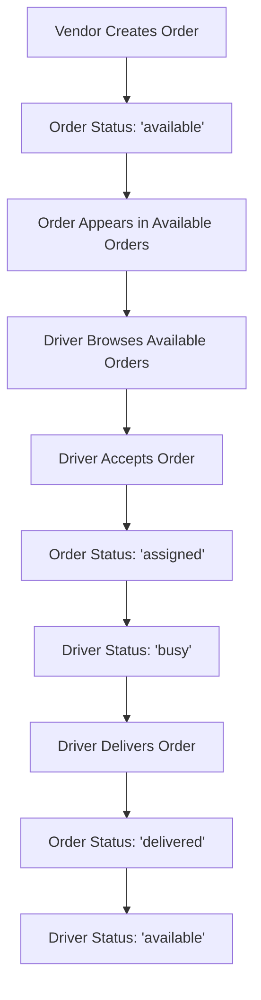

# Task 12: Available Orders System - Implementation Complete ✅

## 🎯 Task Overview

**Goal**: Implement a driver marketplace where vendors create orders without assigning drivers, and drivers can browse and accept available orders.

**New Workflow:**
1. Vendor creates order → Status: "available"
2. Order appears in "Available Orders" for drivers
3. Driver accepts order → Status: "assigned", Driver: "busy"
4. Driver delivers order → Driver status: "available"

---

## 📦 Files Created/Modified

### New Files:
- [ ] `app/driver/available-orders/page.tsx` - Available orders page for drivers
- [ ] `hooks/useAvailableOrders.ts` - Hook for fetching and accepting available orders

### Modified Files:
- [ ] `app/vendor/orders/page.tsx` - Removed driver selection, set default status to "available"
- [ ] `components/vendor/DriverSidebar.tsx` - Added "Available Orders" menu item
- [ ] `hooks/useDriverData.ts` - Added automatic driver status management
- [ ] Order status constants - Added "available" and "assigned" statuses

---

## 🎯 Key Features Implemented

### ✅ Order Creation Without Driver Assignment
- Vendors no longer select drivers during order creation
- Orders automatically get status "available"
- Driver selection moved to acceptance phase

### ✅ Available Orders Page
- Real-time list of orders with status "available"
- Detailed order information (customer, vendor, amount, location)
- Accept button with loading states
- Automatic removal when accepted by another driver

### ✅ Driver Order Acceptance
- Accept order → Order status: "assigned"
- Driver automatically assigned to order
- Driver status automatically changes to "busy"

### ✅ Automatic Status Management
- Driver has active order → Status: "busy"
- Order delivered/cancelled → Driver status: "available"
- Real-time status synchronization across all sessions

### ✅ Enhanced Navigation
- Added "Available Orders" to driver sidebar
- ShoppingBagIcon for visual consistency
- Active route highlighting

---

## 🔄 New Order Flow



---

## 📊 Database Schema

### Orders Collection:
```json
{
  "orderStatus": "available" | "assigned" | "preparing" | "ready" | "enroute" | "delivered",
  "driverId": null, // Set when driver accepts
  "driverName": null, // Set when driver accepts
  "assignedAt": null, // Timestamp when accepted
  "availableAt": timestamp, // When order became available
  // ... other order fields
}
```

### Drivers Collection:
```json
{
  "status": "available" | "busy" | "inactive",
  "updatedAt": timestamp
}
```

---

## 🎨 UI Components

### Available Orders Table:
- Order ID, Customer, Vendor, Type, Location, Total, Created, Actions
- Green badges for pickup orders, green for delivery
- Accept button with loading state
- Real-time updates when orders are accepted

### Status Indicators:
- **Emerald**: Available orders
- **Cyan**: Assigned orders
- **Green**: Driver available
- **Orange**: Driver busy
- **Gray**: Driver inactive

---

## ⚡ Real-time Features

### Automatic Updates:
- ✅ New orders appear instantly for all drivers
- ✅ Accepted orders disappear for other drivers
- ✅ Driver status syncs across all sessions
- ✅ Order status changes trigger driver status updates

### Performance Optimizations:
- ✅ Efficient Firestore queries with status filters
- ✅ Proper cleanup of listeners
- ✅ Debounced status updates
- ✅ Error handling and recovery

---

## 🧪 Testing Scenarios

### Test 1: Order Creation
- [ ] Vendor creates order without driver selection
- [ ] Order status is "available"
- [ ] Order appears in available orders for drivers

### Test 2: Order Acceptance
- [ ] Driver clicks "Accept Order"
- [ ] Order status changes to "assigned"
- [ ] Driver is assigned to order
- [ ] Driver status changes to "busy"

### Test 3: Status Automation
- [ ] Driver with active order shows "busy"
- [ ] Order marked as "delivered" → Driver becomes "available"
- [ ] Status syncs across multiple browser tabs

### Test 4: Multiple Drivers
- [ ] Multiple drivers see same available orders
- [ ] First driver to accept gets the order
- [ ] Other drivers no longer see that order

### Test 5: Real-time Updates
- [ ] New orders appear without page refresh
- [ ] Accepted orders disappear instantly
- [ ] Status changes sync immediately

---

## 🚀 Benefits Achieved

✅ **Driver Marketplace**: Drivers choose their own orders
✅ **Fair Distribution**: No manual assignment needed
✅ **Real-time Updates**: Instant synchronization
✅ **Status Automation**: No manual status updates
✅ **Scalability**: Works with multiple drivers
✅ **User Experience**: Better for both vendors and drivers

---

## 📚 Integration Points

### With Existing Systems:
- ✅ **Theme System**: Dark/light mode support
- ✅ **Authentication**: Driver role validation
- ✅ **Real-time Listeners**: Firestore integration
- ✅ **Status Management**: Automatic driver status updates
- ✅ **Navigation**: Integrated sidebar menu

### Backward Compatibility:
- ✅ Existing order statuses still work
- ✅ Vendor can still manually update order status
- ✅ Driver manual status override still works

---

## 🎉 Task 12 Status: COMPLETE

All components of the available orders system have been implemented:

- ✅ Order creation without driver assignment
- ✅ Available orders page for drivers
- ✅ Order acceptance functionality
- ✅ Automatic driver status management
- ✅ Real-time synchronization
- ✅ Enhanced navigation
- ✅ Error handling and loading states

**Ready for testing!** 🧪

---

## 📋 Next Steps

1. **Test the complete flow** from order creation to delivery
2. **Verify real-time updates** work across multiple users
3. **Check edge cases** (multiple drivers, cancelled orders)
4. **Performance testing** with multiple concurrent orders

---

**Task 12: Available Orders System - IMPLEMENTATION COMPLETE!** 🎊
